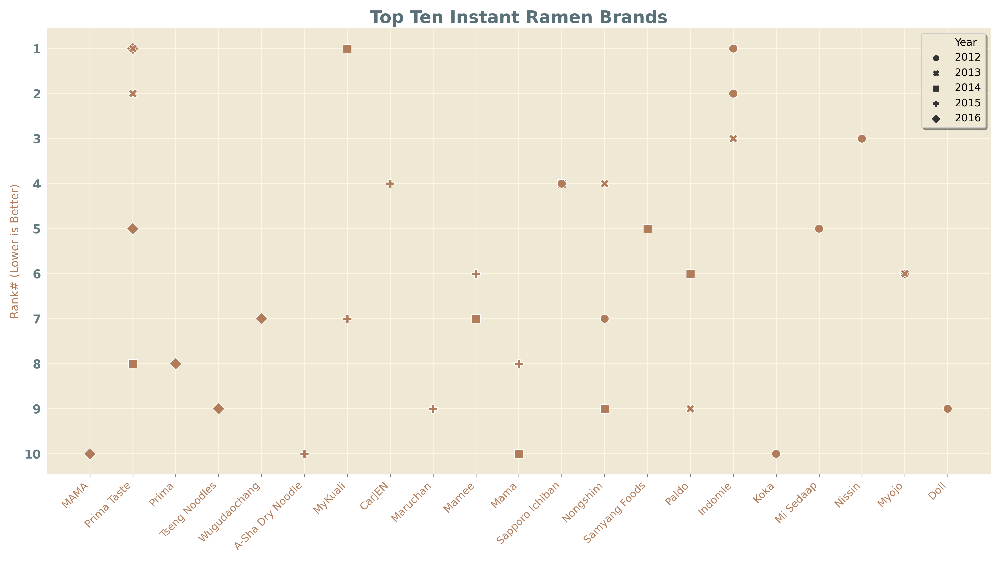

# Data Visualization

This repository contains graphs of various csv data sets and associated python files. 

## Prerequisites

Remember to check if you have the proper python modules installed before running the script for each graph. 

## Acknowledgments
Special thanks to the data scientists at [kaggle.com](https://www.kaggle.com/) for providing the data.  Information about the data source can be found in the folder of the associated graph.

### Graph Artist
* **Henry Li**

### Examples

